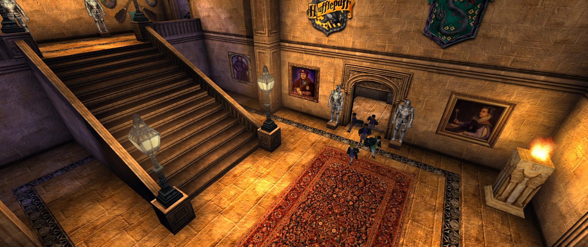
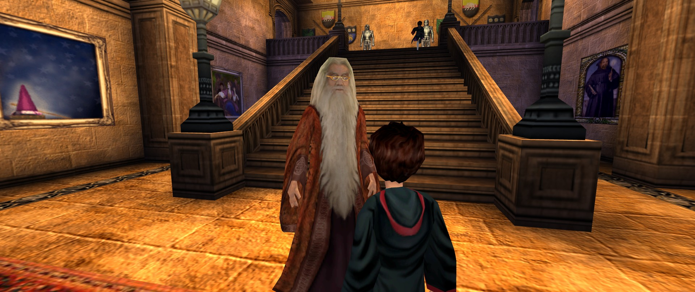
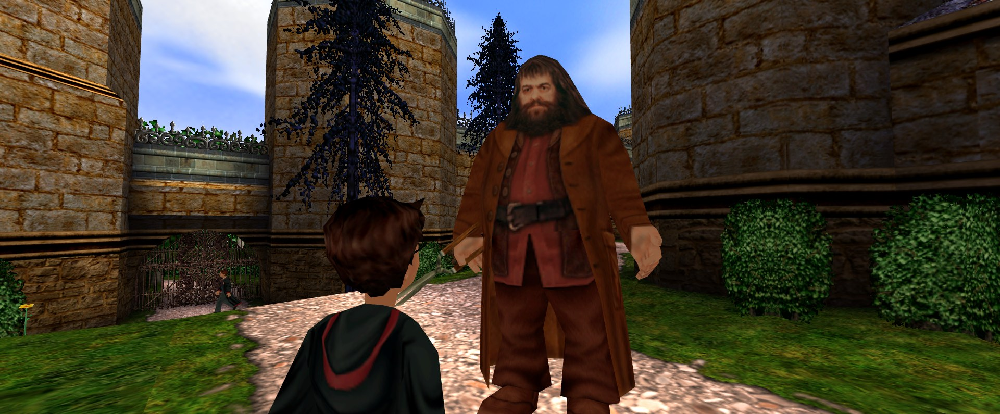
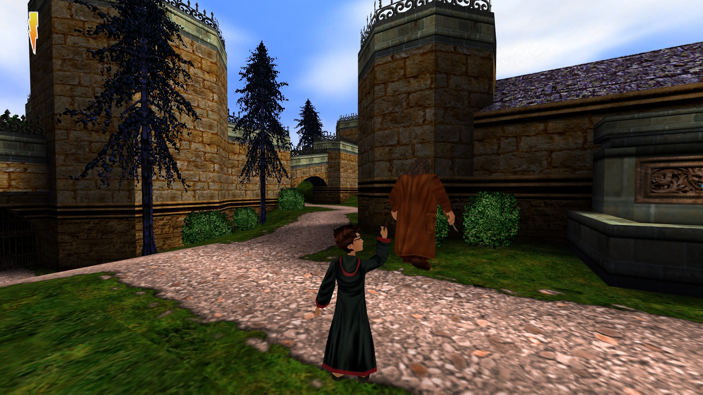
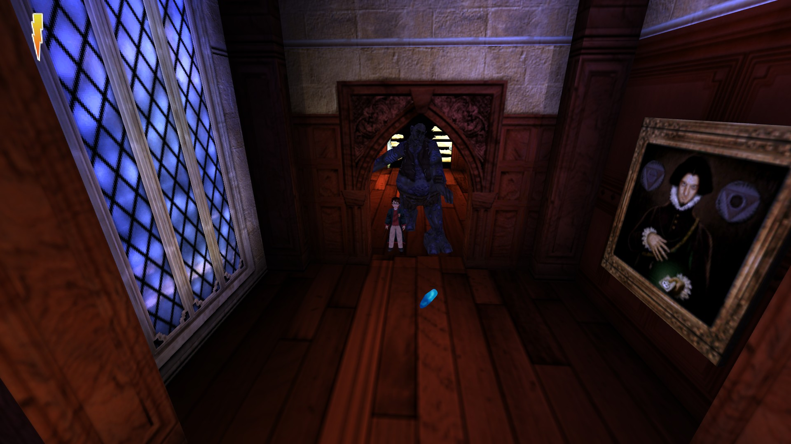
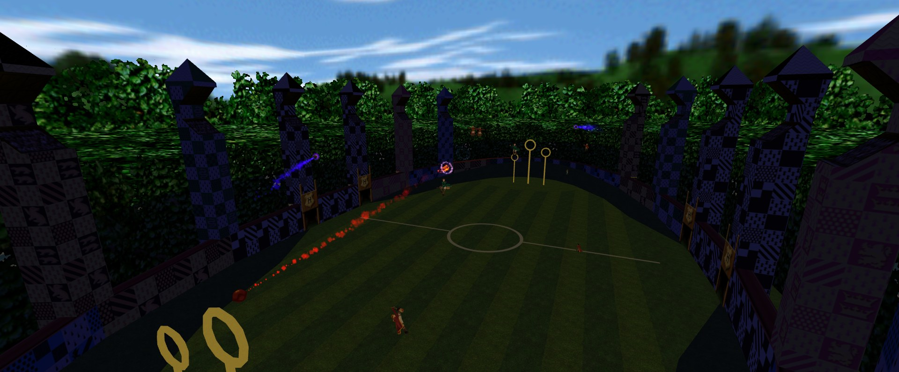
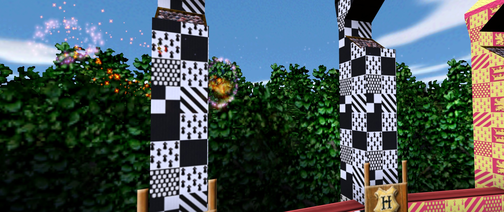
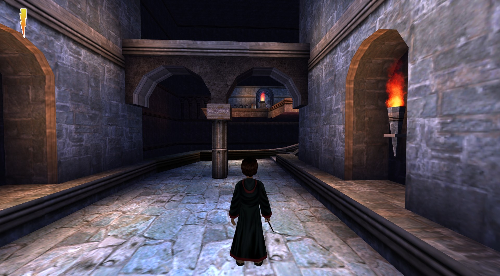

<p align="center">
  <picture>
    <source media="(prefers-color-scheme: dark)" srcset="images/branding/flipendo-logo-dark.png">
    <source media="(prefers-color-scheme: light)" srcset="images/branding/flipendo-logo.png">
    
  </picture>
</p>

<p align="center">
  <b>Play the 2001 Harry Potter PC game on a modern PC:<br>
  native resolution, real widescreen, no SafeDisc, moddable.</b><br>
  <sub>Harry Potter and the Philosopher's Stone / Sorcerer's Stone (KnowWonder, 2001), running on an open-source engine.<br>
  Named after the first spell Harry learns in the game.</sub>
</p>

<p align="center">
  <a href="#screenshots">Screenshots</a> ·
  <a href="#status">Status</a> ·
  <a href="#how-to-play">How to play</a> ·
  <a href="#extras-and-mods">Extras &amp; mods</a> ·
  <a href="#community">Community</a> ·
  <a href="CONTRIBUTING.md">Contributing</a> ·
  <a href="ROADMAP.md">Roadmap</a>
</p>

<p align="center">
  
</p>

Flipendo runs your copy of **Harry Potter and the Philosopher's Stone** (called *Sorcerer's Stone* in the US;
PC, 2001, KnowWonder / EA) on [SurrealEngine](https://github.com/dpjudas/SurrealEngine), an open-source
reimplementation of Unreal Engine 1. The levels, scripts, voices and music all come from your own installation.
Flipendo replaces only the 2001 engine underneath them.

**You need your own copy of the game.** Flipendo contains no game data.

## Why play it this way?

The 2001 release is getting hard to run. SafeDisc copy protection doesn't work on Windows 10/11, the menus stop at
1024x768 and widescreen needs community patches. Flipendo fixes all of that without touching your game files:

- **Any resolution, real widescreen.** 1080p, 1440p, 4K, ultrawide. The view gets wider instead of being cropped,
  the HUD and cutscene bars fill the screen, and the menu book keeps its shape.
- **Modern renderer.** Vulkan, Direct3D 11/12 or OpenGL instead of Direct3D 7.
- **No disc, no SafeDisc, no compatibility patches.** Point it at the installed game folder.
- **The same game.** Nothing is remade or altered. Optional extras (skippable cutscenes and storybooks, fast forward) can all
  be switched off with `--vanilla`.
- **Fixable.** Bugs in the original engine get fixed in source ([list](docs/re/hp1/original_bugs.md)). Linux, macOS
  and Steam Deck can follow because SurrealEngine already runs on them.

## Screenshots

All taken in Flipendo at 1920x1080 from the original game files.

<table>
  <tr>
    <td></td>
    <td></td>
  </tr>
  <tr>
    <td></td>
    <td></td>
  </tr>
  <tr>
    <td></td>
    <td></td>
  </tr>
  <tr>
    <td colspan="2"></td>
  </tr>
</table>

## Status

> **Early work in progress: the game can't be played start to finish yet.** There are no downloads yet; for now
> you build it yourself (below). Follow progress on [Discord](#community) or in [`ROADMAP.md`](ROADMAP.md).

| | |
|---|---|
| ✅ Works | Menus and options (incl. key rebinding), widescreen at any resolution, music, cutscenes, characters and their animations, doors, NPCs, Peeves, jelly beans, wizard cards, saving and loading |
| 🟡 Partly | The first level plays through the Flipendo lesson and moves on to the next level. Spell casting and particle effects mostly work. Broom and Quidditch levels load and play their intros |
| ❌ Not yet | A full playthrough, Linux / macOS builds, prebuilt downloads |

Harry Potter and the Chamber of Secrets (2002) runs on the same engine and is next once the first game is finished.

## How to play

### What you need

- **Harry Potter and the Philosopher's / Sorcerer's Stone for PC (2001)**, installed: the folder with `System/`,
  `Maps/`, `Textures/` and so on. Known versions: UK 1.1, EN retail and a community No-CD. If yours isn't
  recognised, the error shows a code (SHA-1); please [report it](CONTRIBUTING.md#other-game-versions).
- **Windows 10/11** for now.

### Get it running

Until the first release, Flipendo is built from source. That takes a few minutes and needs
[Visual Studio 2026](https://visualstudio.microsoft.com/) with the *Desktop development with C++* workload, and
[Git for Windows](https://git-scm.com/download/win). In Git Bash:

```sh
git clone --recursive https://github.com/kroplabeskidu/flipendo
cd flipendo
tools/build.sh
build/Release/SurrealEngine.exe "C:/Games/Harry Potter"
```

The last line opens the game; use your own install folder in place of `C:/Games/Harry Potter`. If it doesn't start, the error says which file or folder is
missing: see [troubleshooting](docs/troubleshooting.md). Building on Linux or macOS is covered in
[CONTRIBUTING.md](CONTRIBUTING.md#building).

### Launch options

| Option | What it does |
|---|---|
| `--skip-splash` | skip the logo screens |
| `--skip-intro` | New Game goes straight to the first level |
| `--vanilla` | turn off every extra the original doesn't have |
| `--logfile=flipendo.log` | write a log file (attach it to bug reports) |

## Extras and mods

The faithful port and the additions are kept apart: an extra never changes how the game plays unless it is
switched on, and `--vanilla` switches all of them off.

| Extra | Default | What it does |
|---|---|---|
| Cutscene skip | on | "Press Space to skip" during cutscenes |
| Storybook skip | on | "Press Space to skip" in storybooks (New Game intro, chapter interludes) |
| Fast forward | on | hold Shift to play 2.5x as fast |
| Launch skips | off | `--skip-splash`, `--skip-intro` |

**Coming:** an in-game *Extras* page to switch these on and off, FOV slider, uncapped framerate, controller support,
a speedrun timer, and drop-in `Mods/` folders for texture packs, custom levels and script mods, including the
levels the HP1 modding community has already made. In-game modding tools (actor inspector, property editor,
mod manager) are planned too. See [docs/modding.md](docs/modding.md) to write a mod today or help shape the platform.

## Community

- **Discord**: [join the server](https://discord.gg/tCJs6wmABw) to share screenshots, report bugs, talk modding
  and reverse engineering.
- **Bugs and ideas**: open an issue. Include your game version, what you did, and the log (`--logfile=...`).
- **Help out**: playtesting, modding, reverse engineering, C++. Most of it needs no programming:
  [CONTRIBUTING.md](CONTRIBUTING.md).

## Legal

Flipendo's own code is copyright 2026 the Flipendo authors and open source under the
[GNU General Public License, version 3](LICENSE): free to use, modify and share, as long as what you share keeps its
source open under the same licence. `src/engine/` is SurrealEngine (zlib licence). Flipendo is an independent project, **not
affiliated with or endorsed by SurrealEngine, EA, Warner Bros. or KnowWonder**; please report problems here, not to
SurrealEngine. It is a reimplementation written from studying how the original game behaves (its scripts, data and
binaries), so that the game's own files run on a new engine. It contains no Epic, EA or KnowWonder code or data.

Harry Potter is a trademark of Warner Bros. Entertainment. The game data is copyright EA / KnowWonder and is not
included.
